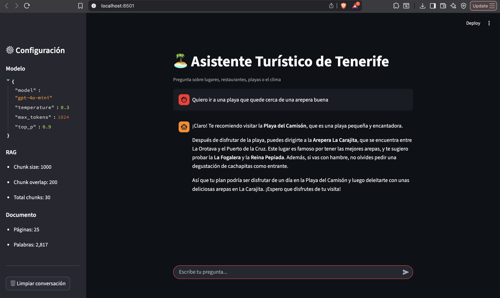

# 🏝️ Asistente Turístico de Tenerife

**Práctica Final - Large Language Models**

---

## Descripción

Chatbot conversacional que responde preguntas sobre Tenerife utilizando:

- **RAG (Retrieval-Augmented Generation)**: Respuestas basadas en una guía turística local
- **Diálogo Multiturno**: Mantiene el contexto de la conversación
- **Function Calling**: Integración con función de predicción meteorológica
- **Interfaz Web**: Aplicación Streamlit interactiva



---

## Estructura del Proyecto

```
LLM_IA0925/
├── .env                    # Variables de entorno (API Key)
├── app.py                  # Aplicación Streamlit
├── notebook.ipynb          # Notebook principal
├── assistant.log           # Archivo de logs (se genera automáticamente)
├── README.md
├── requirements.txt        # Dependencias
├── assets/                 # Imágenes y recursos
│   └── app_screenshot.png
├── src/                    # Módulos Python
│   ├── __init__.py
│   ├── conf.py             # Configuración y parámetros del modelo
│   ├── logger.py           # Configuración de logging
│   ├── api_client.py       # Cliente OpenAI (clase OpenAIClient)
│   ├── data_loader.py      # Carga de documentos (clase DataLoader)
│   ├── vector_store.py     # Chunking, embeddings y búsqueda (clase VectorStore)
│   ├── rag_chain.py        # Cadena RAG con function calling (clase RAGChain)
│   ├── weather_service.py  # Servicio de clima (clase WeatherService)
│   └── system_prompt.txt   # Prompt del sistema (ROCA)
└── data/
    └── TENERIFE.pdf        # Guía turística de Tenerife
```

---

## Instalación

### 1. Clonar el proyecto

```bash
git clone https://github.com/anto-tipfortab/llm_ia0925.git
cd llm_ia0925
```

### 2. Crear entorno virtual (recomendado)

```bash
python -m venv venv

# Activar en Mac/Linux:
source venv/bin/activate

# Activar en Windows:
venv\Scripts\activate
```

### 3. Instalar dependencias

```bash
pip install -r requirements.txt
```

### 4. Configurar API Key

Crear archivo `.env` en la raíz del proyecto:

```
OPENAI_API_KEY=sk-tu-clave-aqui
```

### 5. Añadir el PDF

Copiar `TENERIFE.pdf` a la carpeta `data/`.

---

## Uso

### Aplicación Streamlit (Recomendado)

```bash
streamlit run app.py
```

Se abrirá en el navegador en `http://localhost:8501`

**Características:**
- Interfaz de chat interactiva
- Sidebar con configuración del modelo y estadísticas
- Indicador de uso de función de clima
- Botón para limpiar conversación

### Ejecutar el notebook

```bash
jupyter notebook notebook.ipynb
```

### Probar desde consola

```bash
ipython -c "
from src.conf import PDF_PATH
from src.api_client import OpenAIClient
from src.data_loader import DataLoader
from src.vector_store import VectorStore
from src.rag_chain import RAGChain
from src.weather_service import WeatherService

# Setup
client = OpenAIClient()
loader = DataLoader(PDF_PATH)
pages = loader.load()

# Build RAG with weather function
vector_store = VectorStore()
vector_store.build_from_documents(pages)
weather_service = WeatherService(simulated=True)
rag = RAGChain(client, vector_store, weather_service=weather_service)

# Query about places
result = rag.query('¿Cómo puedo subir al Teide?')
print(result['answer'])

# Query about weather (triggers function calling)
result = rag.query('¿Qué tiempo hará mañana?')
print(result['answer'])
"
```

---

## Módulos

### `src/conf.py`
Configuración centralizada:
- `OPENAI_API_KEY`: Clave de API
- `MODEL_CONFIG`: Parámetros del modelo (model, temperature, max_tokens, top_p)
- `PDF_PATH`: Ruta al documento
- `CHUNK_SIZE`, `CHUNK_OVERLAP`: Configuración para RAG

### `src/logger.py`
- `setup_logger()`: Crea instancia de logger
- `logger`: Instancia por defecto para usar en otros módulos

### `src/api_client.py`
Clase `OpenAIClient`:
- `test_connection()`: Verifica conexión con OpenAI
- `get_completion(messages)`: Obtiene respuesta del modelo
- `get_completion_with_functions(messages, tools)`: Para function calling

### `src/data_loader.py`
Clase `DataLoader`:
- `load()`: Carga el PDF y extrae páginas
- `get_stats()`: Estadísticas del documento
- `get_page(index)`: Contenido de una página específica
- `get_all_text()`: Todo el texto concatenado

### `src/vector_store.py`
Clase `VectorStore`:
- `build_from_documents(pages)`: Divide en chunks, genera embeddings y almacena en ChromaDB
- `load_existing()`: Carga vector store existente desde disco
- `search(query, k)`: Busca los k chunks más relevantes
- `search_with_scores(query, k)`: Búsqueda con puntuaciones de similitud
- `get_chunk_stats()`: Estadísticas de los chunks

### `src/rag_chain.py`
Clase `RAGChain`:
- `query(question, k)`: Procesa pregunta y devuelve respuesta con fuentes
- `clear_history()`: Limpia el historial de conversación
- `get_history()`: Obtiene el historial actual

Soporta:
- Conversación multiturno con gestión de historial
- Function calling integrado con WeatherService
- Retorna `tool_called: True/False` para indicar si se usó una función

### `src/weather_service.py`
Clase `WeatherService`:
- `get_weather(date, location)`: Obtiene pronóstico del tiempo
- `get_tool_schema()`: Retorna el schema JSON para OpenAI
- `parse_tool_call(tool_call)`: Parsea y ejecuta llamadas del LLM

Características:
- `simulated=True`: Genera datos realistas de clima tinerfeño (default)
- `simulated=False`: Preparado para API real (requiere `api_key`)
- Validación con Pydantic (`WeatherRequest`, `WeatherResponse`)
- Manejo de errores: formato de fecha inválido, fecha muy lejana, fechas pasadas
- Soporte para fechas en lenguaje natural ("mañana", "hoy", "fin de semana")

### `src/system_prompt.txt`
Prompt del sistema usando metodología ROCA:
- **R**ole: Define el rol del asistente
- **O**bjective: Objetivo principal
- **C**onstraints: Restricciones y límites
- **A**ction: Cómo debe responder

### `app.py`
Aplicación Streamlit:
- Interfaz de chat interactiva
- Sidebar con configuración y estadísticas
- Cache de RAG chain para mejor rendimiento
- Gestión de historial de conversación

---

## Parámetros del Modelo

| Parámetro | Valor | Justificación |
|-----------|-------|---------------|
| model | gpt-4o-mini | Balance entre coste y calidad |
| temperature | 0.3 | Respuestas deterministas, menos alucinaciones |
| max_tokens | 1024 | Suficiente para respuestas detalladas |
| top_p | 0.9 | Respuestas enfocadas |

## Parámetros de RAG

| Parámetro | Valor | Justificación |
|-----------|-------|---------------|
| chunk_size | 1000 | Tamaño suficiente para contexto coherente |
| chunk_overlap | 200 | Evita cortar frases entre chunks |

## Parámetros de Conversación

| Parámetro | Valor | Justificación |
|-----------|-------|---------------|
| max_history | 5 | Últimos 5 turnos de conversación para mantener contexto sin exceder tokens |

---

## Autor

Antonio Rodriguez

## Licencia

MIT